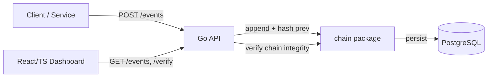

# audittrail

Ein unveränderlicher, kryptografisch verketteter Audit-Log-Service. Jeder Eintrag enthält den Hash des vorherigen Eintrags (Hash-Chain) — nachträgliches Verändern oder Löschen von Log-Einträgen wird dadurch sofort erkennbar. Kein Blockchain-Overhead, nur die Verkettungs-Idee, angewendet auf ein klassisches Audit-Log.

Gebaut, um Nachvollziehbarkeit (Audit-Trails, wie sie z. B. in regulierten Umgebungen wie Medizinsoftware/QMS gefordert sind) technisch sauber zu demonstrieren — mit Go-Backend, PostgreSQL-Speicherung und einem React/TypeScript-Dashboard zur Visualisierung der Kette.

## Architektur



- **`internal/chain`** — Kernlogik der Hash-Chain: neuer Eintrag = `hash(prev_hash + payload)`, plus Verifikationsfunktion, die die gesamte Kette durchläuft und bei einem Bruch fehlschlägt (fail-closed).
- **`internal/storage`** — PostgreSQL-Anbindung, Einträge werden nur angehängt (WORM-artig), kein Update/Delete auf bestehende Zeilen.
- **`cmd/audittrail`** — Entry point, verdrahtet HTTP-API mit `chain` und `storage`.

## Status

Frühe Phase — Grundgerüst steht, Kernlogik folgt. Siehe [PLAN.md](./PLAN.md) für die geplanten Schritte.

## Entwicklung

```bash
make dev    # startet den Service lokal
make test   # Tests
make build  # Binary nach bin/
```

Voraussetzung: Go 1.22 (über `mise`, siehe `mise.toml`).
